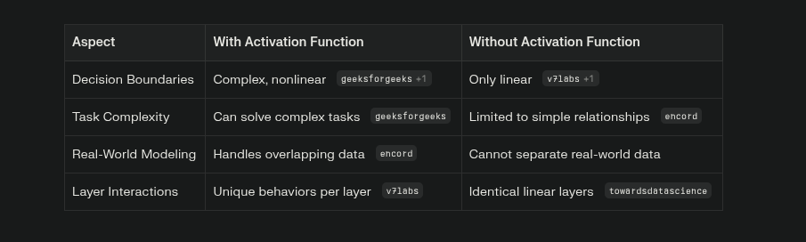
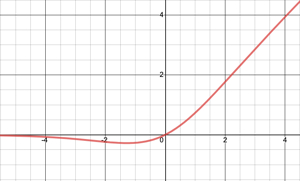
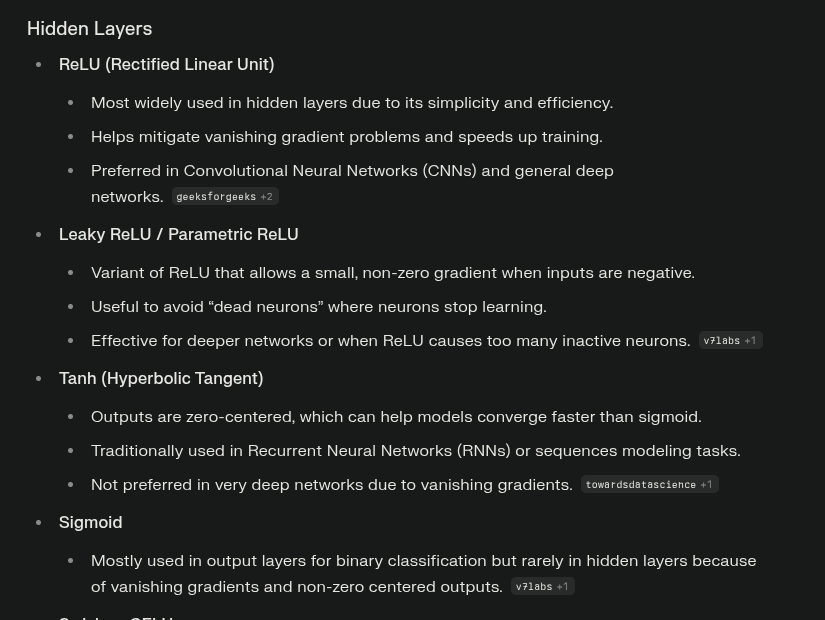
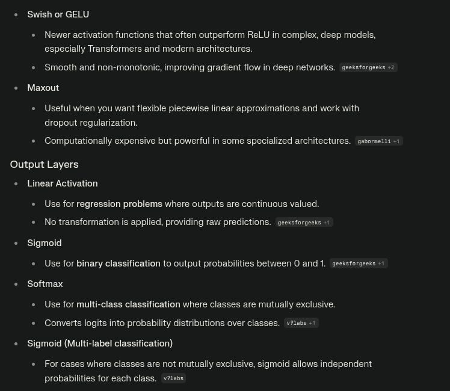
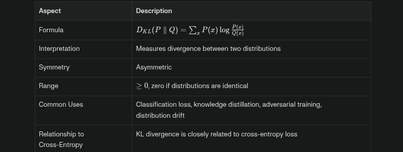
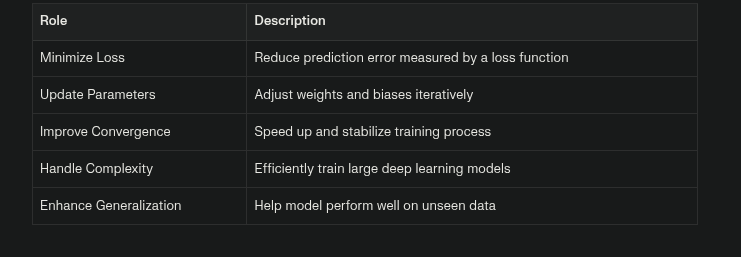

# Arificial Neural Network

### What is the need of DL when we already have ML ?

- Deep learning (DL) is essential for complex data and tasks where traditional machine learning (ML) methods struggle, especially with unstructured data like images, audio, and text, or when feature extraction is difficult or impractical.

- Whenever we have complex relationship between the dataset then ML will not be able to understand the relationship.

- Key Reasons for Deep Learning

    - Handling Unstructured Data
     
    - Automatic Feature Extraction
     
    - Scalability and Performance
     
    - Applicability to Complex Problems

### What is the need of activation function in Neural network ?

- Activation functions are essential in neural networks because:

    - They introduce Non-Linearity
    
    - Enabling Complex Decision Making : Real-world data is rarely separated by simple boundaries

    - Dynamic Neuron Behavior : Activation functions decide whether a neuron should be “activated” based on its input

### Activations functions 

- **Swish**

    - f(x) = x × sigmoid(βx) = x × 1/(1+e ^−βx)
 
    - where β is a configurable or trainable parameter that controls the shape of the function.

    - It perfrom better than ReLU in deep neural network.

    - Unlike ReLU, Swish does not zero out negative inputs completely; it allows some negative values to pass, which is useful for learning complex patterns.

    - The function is smooth and differentiable everywhere, which aids optimization and gradient-based learning.

    - Swish has been shown empirically to improve performance on deep neural networks, often outperforming ReLU on tasks such as image classification and machine translation.

    - When β=1, Swish reduces to the SiLU (Sigmoid-weighted Linear Unit) activation function.

    

- **Max-out**

    - f(x) = max( w1x1+b1 , w2x2+b2 , ...)
    
    - It gives the output which is maximum among the pool.

    - Maxout can approximate a wide range of activation functions, including ReLU, absolute value rectifier, and others.

    - Works well with dropout, improving generalization.
    
    - Computationally expensive and high Model Complexity due to multiple linear operations per neuron.

- **GELU** ( Gaussian Error Linear Unit )

    

    - It is a modern activation used extensively in state-of-the-art neural networks, especially in Transformer models like BERT and GPT.

    - Smooth nonlinearity improves training stability.
  
    - Better performance on tasks like NLP, vision compared to ReLU and others.
    
    - Widely adopted in modern architectures such as Transformer-based language models.

### Where we have to use which activation function?

- It is an experimental thing.

- We have to check where the convergence is faster and accurate.

- You can follow the below to use activation function in general.

### Loss Functions

- **Log-Cosh Loss**

    - Loss = ∑ log(cosh( y^ −y ))

    - It is a smooth loss function used for regression problems.

    - It behaves like the Mean Squared Error (MSE) loss for small differences between predicted and true values, thus ensuring smooth gradients.

    - For large errors, it behaves more like the Mean Absolute Error (MAE), making it less sensitive to large outliers compared to MSE.

    - Its smoothness makes it easier to optimize with gradient-based methods.

    - Well-suited for regression problems where occasional large errors/outliers exist.

- **Kullback-Leibler (KL) Divergence Loss**

    - It is a measure used in machine learning to quantify how one probability distributionQ diverges from a reference or true distribution P.

    

### What is the roles and responsibility of optimizer ?

- The optimizer in machine learning and deep learning plays a crucial role in improving model performance by iteratively adjusting the model’s parameters, such as weights and biases, to minimize the loss function.

- Roles and Responsibilities of an Optimizer:

    - Minimizing the Loss Function
    - Updating Model Parameters
    - Controlling Convergence Speed and Stability
    - Handling Large and Complex Models
    - Enhancing Generalization

### What is momentum optimizer and how it works ?

## Note:

- Inside a hidden layer all neurons there must be same activation function.

- We can change the activation function layer-wise.

