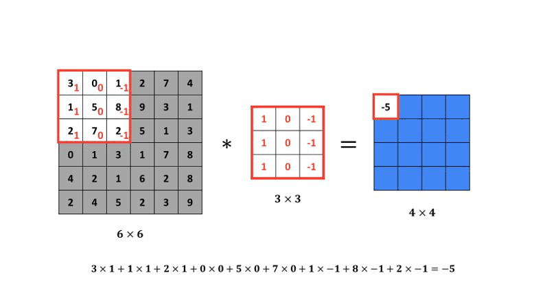
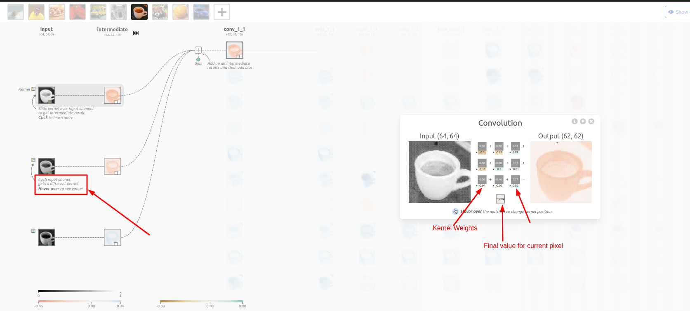
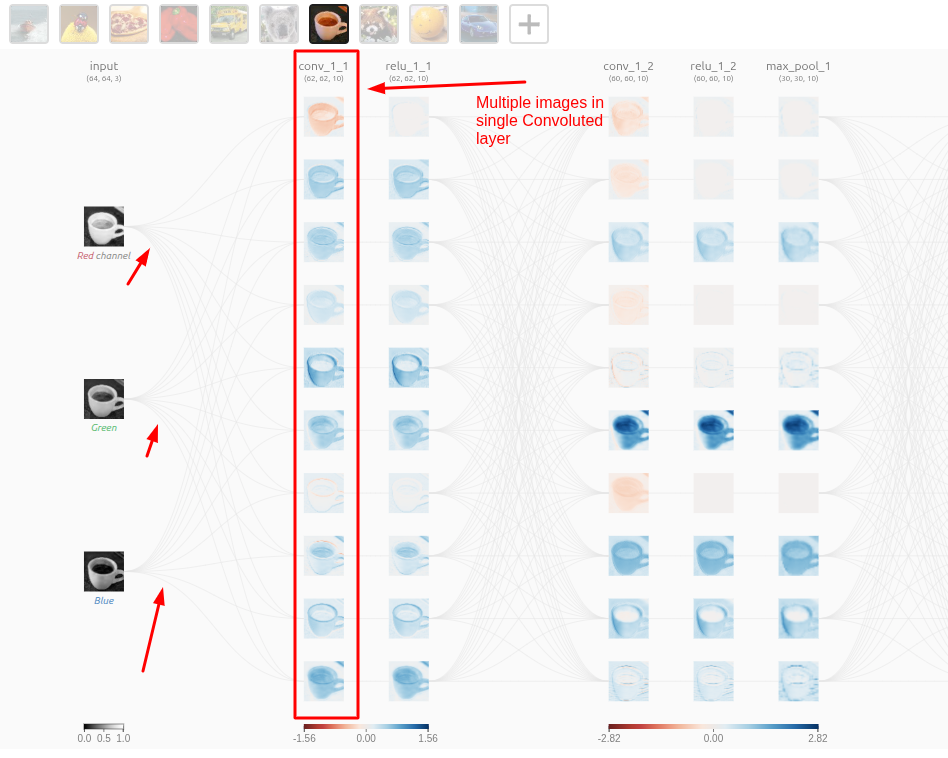
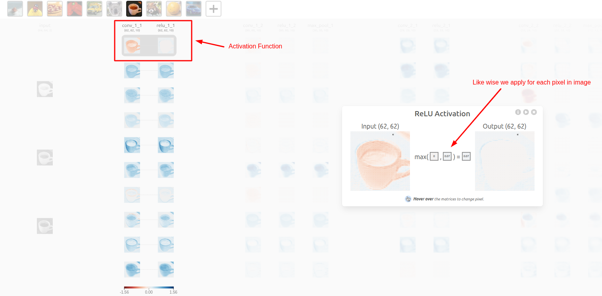
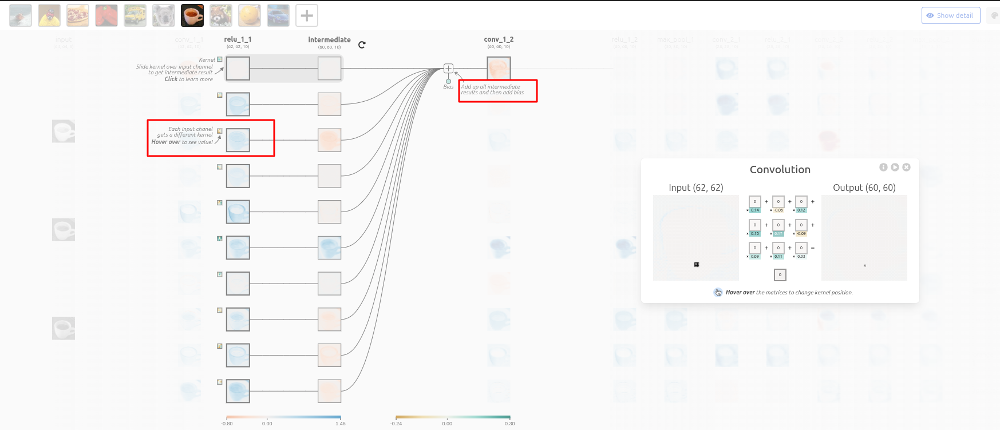
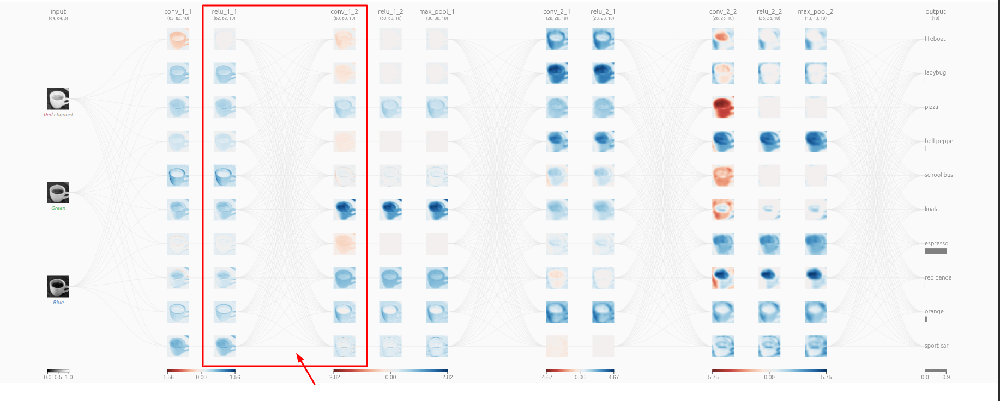
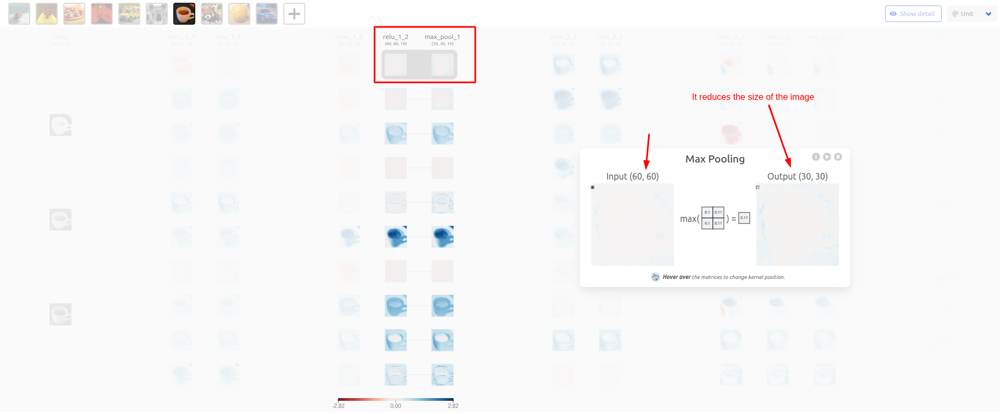
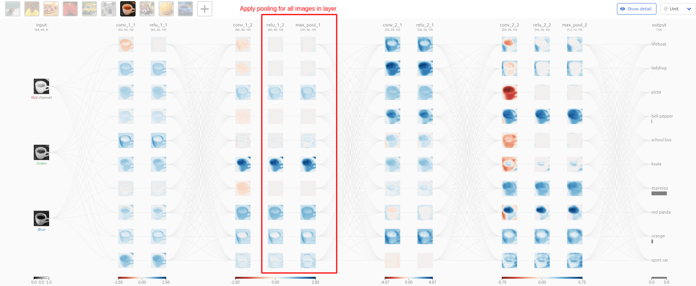
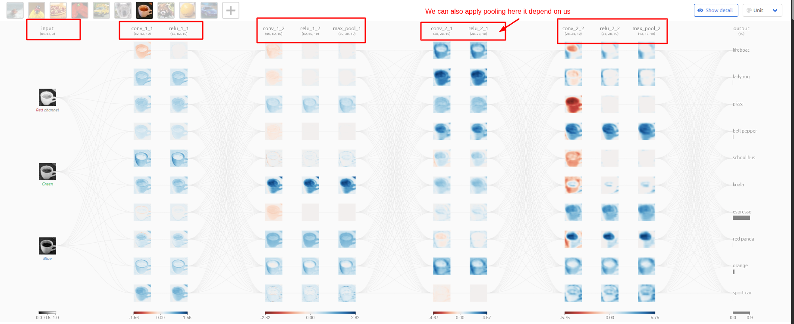

# CNN ( Convolutional Neural Network )

- It is a specialized neural network which will be able to learn images.

- It is a part of computer vision.

- How it will be able to learn the pattern in the images ?

- Now lets take the human being images.

- You will be able to find alot of the common things in these images.

- We all have eyes , noise, ears , chin, etc.

- And all these things are featues.

- And in real life we also identify someone with all of these features.

- And what if the system wil identify the similar kind of features inside the images.

- then it will be able to recognize the person.

---------------------------------

- Now we all know that a picture is a combinations of pixels.

- And if we talk about a colured image is a combination of three layers of these combination of pixels.

- that is 1 layer of each color ( rgb ==> Red , Green , Blue).

- And each layer and pixel representing the data.

- And if we send this layers of data to neural network for learning.

- And if our neural network will able to learn the relation between this data my work will be done.

---------------------------------------

- Ques: How i am going to prepare these data from the images and what are the learnable parameters over here ?

- So there there are something called as kernel ( filters ).

-------------------------------------------

### What kernel are and what they does, because kernel the major part here?

- So kernel are applied to the image to extract or learn the features ( edges, color, shape ) from the image. 

- And we learn those features in the form of kernel. 

- So kernel is a matrix of 2*2 or 3*3 ,etc.

- So initially we define the random kernel.

- And then these kernel will be learned based on the loss function and optimization.

- Now we apply this kernel to the image.







- And likewise we apply multiple kernel on a single layer of the image itself not just one.

- And each kernel is responisble for learning some of the feature from the image.

- Compare the kernel with the weights in ANN.

- Here kernel is doing the same thing as weights are doing in ANN.

- And after applying the kernel it will give you new convoluted layer.

- Now we apply the Activation function on top of the convulated layer.



- Now again we create another Convoluted layer.



- Likewise we do for all the images in convoluted layer 1.



- Now after we again apply the Activation function on convoluted layer 2.

- And then we apply the Pooling.

## Pooling

### Why we use pooling ?

- **Dimensionality Reduction**

    - Without pooling, every convolution layer keeps the feature map size large
    - Pooling reduces the number of pixels → fewer computations → faster training and inference.

- **Prevent Overfitting**

    - Smaller feature maps mean fewer parameters in later fully connected layers.
    - This reduces the chance that the model memorizes training data instead of generalizing.

- **Keeps Important Features**

    - Pooling keeps the dominant activations (like edges, textures, or patterns) while discarding small/noisy variations.

    - So the model focuses on what matters.

- **Translation Invariance**

    - If an object in the image shifts slightly (say, a cat’s ear moves 2 pixels to the left), convolution outputs shift too.

    - Pooling smooths this effect, making the network recognize the same feature regardless of its exact location.

- **Hierarchical Feature Learning**

    - Early layers detect edges, later layers detect shapes, and pooling compresses information at each stage.

    - This helps the network build a pyramid of features → small details first, then larger concepts.

- **Pooling makes CNNs faster, more robust, less prone to overfitting, and more invariant to small changes in input images.**

### How does the Pooling works

- In Pooling we select the size of grid 2*2 , 3*3 , etc.

- And we select that size matrix from the image and select only single value from that matrix.

- And use the selected number for the next images.

- And there are two types of pooling.

    - Max pooling : select the maximum number from the grid.

    - Min pooling : select the minimum number from the grid.





- And then we repeat same process multiple times ( Kernel > Activation function > Pooling ).

- And in this way we have multiple convulated layes one after another.



- Goto CNN Explainer for the more detailed info ```https://poloclub.github.io/cnn-explainer/```.

-------------------------------------

- Ok i am able to pass this one time but what after that ? 

- How we predict the image to belong to which one ?

- How the Kernel weights will be fixed because first time we have just randomly assign the kernel values.

- We also need to learn how the flatning layer ( fully connected layer works ).

